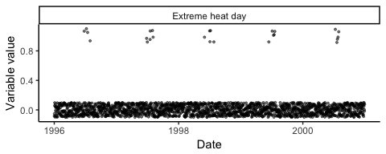

<!-- README.md is generated from README.Rmd. Please edit that file -->
[](https://travis-ci.org/sakoehler7/eesim)

Overview of package
-------------------

This package allows you to simulate time series of environmental health data and perform simulation-based power analyses and other measures of model performance. The package includes four main parts:

1.  Generation of exposure data (simulated or from real data);
2.  Generation of simulated outcome data;
3.  Fitting models to generated data; and
4.  Evaluating model performance on generated data.

The user has the option to customize different aspects of the simulation at each of these steps.

The package creates simulated time series data that are relevant for environmental epidemiology studies of ambient exposures (e.g., studies of acute mortality risks associated with daily air pollution concentration, daily temperature, or occurance of a community-wide extreme event like a heat wave). Simulated environmental datasets like those created by the package can be used in to assess the performance of statistical models meant to estimate the association between exposure level and outcome risk, to estimate power for a planned study, and to develop a better understanding of the data generating processes behind observed environmental datasets. Such time series are often characterized by both seasonal and long-term trends in both the exposure of interest and the outcome. For example, the following plot shows time series of daily ozone concentration (in parts per billion \[ppb\]) and cardiovascular deaths in Chicago, IL (1996--2000), with smoothed lines overlaid on the raw data to show patterns over time.


Basic example of using the package
----------------------------------

The main function of this package is the `eesim` function. You can use the `eesim` function to conduct all four steps of the simulation process at once (generate exposure data, generate outcome data, fit models to simulated data, and evaluate model performance).

The `eesim` function requires inputs on:

-   `n`: The desired number of observations per simulated dataset (for a daily time series, this is the desired number of days in the simulated dataset)
-   `n_reps`: The desired number of simulated datasets
-   `exposure_type`: Whether the exposure is binary (e.g., occurence of an extreme event like a heat wave or wildfire) or continuous (e.g., concentration of a pollutant)
-   `rr`: The relative rate of the outcome associated with the exposure. For a binary exposure, this is the relative rate associated with the exposure compared to a similar day without the exposure. For a continuous exposure, this is the relative rate associated with a one-unit increase in the exposure.
-   `model`: The model to be used to estimate the association between exposure and outcome in the simulated datasets, either to estimate power of a planned analysis or to otherwise evaluate the performance (e.g., coverage, bias) of a model on the simulated datasets.

A number of optional inputs can also be specified, including arguments to adjust the shape of seasonal or long-term trends in the exposure or outcome data or custom arguments to use at different steps of the data generation.

The function returns a list with three elements. The first element is a list with all the simulated datasets. The second element gives simulation-specific results for each simulated dataset: the estimated effect, standard error, t- and p-values, and upper and lower 95% confidence bounds when a model was applied to each of the simulated datasets. The third element gives some measures of model assessment, assessed over all simulations, including the mean beta and relative risk estimates across simulations.

For example, in the observed data from Chicago, IL, shown in the plots above, daily ozone concentrations have a mean of about 20 ppb and standard deviation of about 7 ppb after removing seasonal and long-term trends. The average number of cardiovascular deaths per day is around 50. Here is the code, and a plot of the resulting data, for generating a dataset with similar characteristics for use in a power analysis or to evaluate model performance (later in the vignette, we will show how to use customization to further improve the simulation of data for this example, including avoiding negative values of ozone concentration in simulated data):

``` r
sim_chicago <- create_sims(n_reps = 1, n = 365 * 5, central = 20, sd = 7,
                           exposure_type = "continuous", exposure_trend = "cos1",
                           exposure_amp = -.6, average_outcome = 50,
                           outcome_trend = "cos1", outcome_amp = 0.2, 
                           rr = 1.0005, start.date = "1996-01-01")
head(sim_chicago[[1]])
#>         date          x outcome
#> 1 1996-01-01 14.8541083      64
#> 2 1996-01-02  3.1952265      78
#> 3 1996-01-03  0.4101124      72
#> 4 1996-01-04 10.4824504      69
#> 5 1996-01-05 18.9213207      58
#> 6 1996-01-06  7.8855542      56
```


This simulated data can also be visualized using the `calendar_plot` function that comes with the package:

``` r
a <- calendar_plot(sim_chicago[[1]] %>% select(date, outcome), type = "continuous", 
                   legend_name = "Outcome") + 
  ggtitle("Outcome")
b <- calendar_plot(sim_chicago[[1]] %>% select(date, x), type = "continuous") + 
  ggtitle("Exposure")
grid.arrange(a, b, ncol = 1)
```


You can use the `eesim` function to generate multiple similar simulated datasets and investigate the performance of a specified model in estimating the association between ozone concentration and the risk of cardiovascular death in 20 simulated datasets. You must write a function with the code to fit the model you desire to fit to the simulated data (more details for writing this function are provided later in the vignette), and then you can use the `eesim` function to generate lots of simulated datasets, fit that model, and assess its performance using a call like:

``` r
ex_sim <- eesim(n_reps = 100, n = 365 * 5, central = 20, sd = 7,
                exposure_type = "continuous", exposure_trend = "cos1",
                exposure_amp = -.6, average_outcome = 50,
                outcome_trend = "cos1", outcome_amp = 0.2, 
                rr = 1.2, start.date = "1996-01-01",
                custom_model = spline_mod, custom_model_args = list(df_year = 7))
```

The `eesim` function returns a list with three elements:

``` r
names(ex_sim)
#> [1] "simulated_datasets"  "indiv_performance"   "overall_performance"
```

The first element of the returned object is a list with all of the simulated datasets. For example, you can create a calendar plot of exposure in the first simulated dataset using the call:

``` r
calendar_plot(ex_sim[["simulated_datasets"]][[1]] %>% select(date, x), type = "continuous")
```


The second element of the returned object gives the results of fitting the model to each of the simulated datasets. It can be used to explore the behavior of individual simulations:

``` r
head(ex_sim[["indiv_performance"]])
#>    Estimate    Std.Error  t.value p.value  lower_ci  upper_ci
#> 1 0.1827175 0.0002469170 739.9956       0 0.1822335 0.1832014
#> 2 0.1825011 0.0002090035 873.1962       0 0.1820914 0.1829107
#> 3 0.1821313 0.0002323444 783.8852       0 0.1816760 0.1825867
#> 4 0.1821526 0.0002287805 796.1893       0 0.1817042 0.1826010
#> 5 0.1823460 0.0002251761 809.7930       0 0.1819047 0.1827874
#> 6 0.1823111 0.0002364797 770.9377       0 0.1818476 0.1827746
```

After running the simulation, you can look at the relative risk point estimate and 95% confidence interval from each of the 100 simulations, as well as which 95% confidence intervals include the true relative rate, using the `coverage_plot` function that comes with the package:

``` r
coverage_plot(ex_sim[["indiv_performance"]], true_param = 1.2)
```


The third element of the list returned by a call to `eesim` gives the following overall summaries of model performance across all simulations:

| Variable           | Description                                                                                                                                                                    |
|:-------------------|:-------------------------------------------------------------------------------------------------------------------------------------------------------------------------------|
| `beta_hat`         | **Mean estimate**: The mean of the estimated log relative rate over all simulations.                                                                                           |
| `rr_hat`           | **Mean estimated relative rate**: The mean of the estimated relative rate over all simulations.                                                                                |
| `var_across_betas` | **Variance across estimates**: Variance of the point estimates (estimated log relative risk) over all simulations.                                                             |
| `mean_beta_var`    | **Mean variance of estimate**: The mean of the variances of the estimated effect (estimated log relative risk) across all simulations.                                         |
| `percent_bias`     | **Relative bias**: Difference between the estimated log relative risk and true log relative risk as a proportion of the true log relative risk.                                |
| `coverage`         | **95% confidence inverval coverage**: Percent of simulations for which the 95% confidence interval estimate of log relative risk includes the true value of log relative risk. |
| `power`            | **Power**: Percent of simulations for which the null hypothesis that the log relative risk equals zero is rejected based on a p-value of 0.05.                                 |

For example, here are the overall results for the simulation fit above:

``` r
ex_sim[["overall_performance"]]
#>    beta_hat   rr_hat var_across_betas mean_beta_var percent_bias coverage
#> 1 0.1823186 1.199996     4.880753e-08  5.593839e-08  0.000296735     0.95
#>   power
#> 1     1
```

In later sections of this vignette, we will show how to customize steps in the generation of the simulated data to further improve this example simulation.

As another basic example, here is a plot of the dates of extreme heat days (defined as a day with temperature at or above the 98 percentile temperature in Chicago between 1987 and 2000) in the observed Chicago dataset (points are jittered along the y-axis to limit overlapping):


In this observed data, there is (unsurprisingly) a strong seasonal trend in this binary exposure of extreme heat days. The percent of days that are extreme heat days is 0% for all months expect June (about 5% of days in observed data were extreme heat days), July (about 12% of days), and August (about 2% of days). Similar exposure time series can be simulated with the call:

``` r
sim_chicago2 <- create_sims(n_reps = 1, n = 365 * 5, sd = 1,
                            central = c(0, 0, 0, 0, 0, 0.05, 0.12, 0.02, 0, 0, 0, 0),
                            exposure_type = "binary", exposure_trend = "monthly",
                            exposure_amp = -.6, average_outcome = 50,
                            outcome_trend = "cos1", outcome_amp = 0.2, 
                            rr = 1.05, start.date = "1996-01-01")
```

Here is an example of the simulated exposure data:



Again, both the observed and simulated exposure data can also be plotted using the `calendar_plot` function:

``` r
a <- chicagoNMMAPS %>% 
  mutate(temp = temp >= quantile(temp, probs = 0.98)) %>% 
  tbl_df() %>% 
  filter(year >= 1996) %>% 
  select(date, temp) %>% 
  calendar_plot(type = "discrete", labels = c("Extreme heat day", "Other day")) + 
  ggtitle("Observed exposure data")
b <- sim_chicago2[[1]] %>% 
  select(date, x) %>% 
  calendar_plot(type = "discrete", labels = c("Extreme heat day", "Other day")) + 
  ggtitle("Simulated exposure data")
grid.arrange(a, b, ncol = 1)
```


The comparison of the observed and simulated data in this case suggests some clustering in the observed data that is not evident in the simulated data, suggesting that the probability of exposure may be higher on a day near other extreme heat days.

The `eesim` function can be used to assess the performance of a GLM in estimating relative risk of cardiovascular mortality for extreme heat days compared to other days using:

``` r
ex_sim2 <- eesim(n_reps = 100, n = 365 * 5, 
                 central = c(0, 0, 0, 0, 0, 0.05, 0.12, 0.02, 0, 0, 0, 0),
                 exposure_type = "binary", exposure_trend = "monthly",
                 exposure_amp = -.6, average_outcome = 50,
                 outcome_trend = "cos1", outcome_amp = 0.2, 
                 rr = 1.05, start.date = "1996-01-01",
                 custom_model = spline_mod, custom_model_args = list(df_year = 7))
#> This function may take a minute or two to run, especially if you
#> are creating lots of replications (`n_reps`).
```

As before, a plot of CI coverage can be created with `coverage_plot`:

``` r
coverage_plot(ex_sim2[["indiv_performance"]], true_param = 1.05)
```


Here are the overall estimates in this case for model performance:

``` r
ex_sim2[["overall_performance"]]
#>     beta_hat   rr_hat var_across_betas mean_beta_var percent_bias coverage
#> 1 0.04617133 1.047885      0.001214473  0.0009170105    0.2014185     0.92
#>   power
#> 1  0.34
```

In this case, the expected power is low.

The `power_calc` function in the package allows you to extend on this simulation functionality to create power curves for an analysis given an anticipated underlying process of data generation. This function will create simulations for several different values of number of days in the study (`n`), average daily outcome counts (`average_outcome`), or expected association between exposure and outcome (`rr`).

For example, the following call generates a power curve that explores how expected power changes with an increasing number of days for the heat wave analysis example just presented (as a warning, this call takes a few minutes to run, since it's simulating many datasets):

``` r
ex_power_calc <- power_calc(varying = "n", values = floor(365.25 * seq(1, 20, by = 5)),
                            n_reps = 100, rr = 1.05,
                            central = c(0, 0, 0, 0, 0, 0.05, 0.12, 0.02, 0, 0, 0, 0),
                            exposure_type = "binary", exposure_trend = "monthly", 
                            exposure_amp = -.6, average_outcome = 50,
                            outcome_trend = "cos1", outcome_amp = 0.2, 
                            custom_model = spline_mod, custom_model_args = list(df_year = 7),
                            plot = FALSE)
#> This function may take a minute or two to run, especially with
#> lots of replications (`n_reps`) or options for `values`.
ex_power_calc %>% 
  ggplot(aes(x = values, y = power)) + 
  geom_line() + 
  ylim(0, 1) + 
  labs(x = "Number of days in the study", y = "Power") + 
  theme_bw()
```


Piece-by-piece breakdown of package utility
-------------------------------------------

To demonstrate how the `eesim` function works, here is a breakdown of each of the four main parts: generating exposure data, generating outcome data, fitting models, and evaluating models. The helper functions used for each step are described in detail in this section.

### Generating exposure data

The first task of the package is generating exposure data. This can be done with the `sim_exposure` function. In this function, the user can specify whether he or she would like to generate exposure data that is binary or continuous (`exposure_type`). For continuous exposure data, the user must specify the mean (`central`) and standard deviation (`sd`) of the exposure data. For example, the following call simulates a dataframe of exposure data for an exposure that is normally distributed, with a mean value of 50, a standard deviation of 5, and no long-term or seasonal trends:

``` r
x_cont <- sim_exposure(n = 1000, central = 50, sd = 5, exposure_type = "continuous") 
x_cont %>% slice(1:5)
#>         date        x
#> 1 2001-01-01 51.79315
#> 2 2001-01-02 51.69743
#> 3 2001-01-03 50.91866
#> 4 2001-01-04 51.84013
#> 5 2001-01-05 53.22749
```

``` r
ggplot(x_cont, aes(x = date, y = x)) + geom_point(alpha = 0.2) + 
  theme_classic()
```


You can plot a calendar plot of this simulated exposure time series using the `calendar_plot` function that comes with the package. Within this function, the type of data ("continuous" or "discrete") must be specified:

``` r
calendar_plot(x_cont, type = "continuous")
```


You can similarly use the `sim_exposure` function to simulate a binary exposure (e.g., occurence of an extreme event). For binary exposure data, the `central` argument of `sim_exposure` must also be expressed, but in this case it gives the probability of exposure on a study day:

``` r
x_bin <- sim_exposure(n = 1000, central = 0.05, exposure_type = "binary")
x_bin %>% slice(1:5)
#>         date x
#> 1 2001-01-01 0
#> 2 2001-01-02 0
#> 3 2001-01-03 0
#> 4 2001-01-04 0
#> 5 2001-01-05 0
```

Again, the `calendar_plot` function can be used to visualize the generated time series. In the case of binary exposure data, the labels to be used in the legend for each outcome level must also be specified using the `labels` argument:

``` r
calendar_plot(x_bin, type = "discrete", labels = c("Not exposed", "Exposed"))
```


So far, these `sim_exposure` calls have been used to simulate basic exposure data, without long-term or seasonal trends. However, for environmental epidemiology applications, exposure data often has a seasonal trend and / or long-term trend, and these temporal trends can serve as confounders in assessing the association between time-varying environmental exposures and health outcomes. The `sim_exposure` function therefore includes options to generate exposure data with long-term and seasonal trends relevant to environmental time series studies, through the `trend` argument.

The default for `sim_exposure` is to simulate the exposure data without a time trend (`trend = "no trend"`). However, we have also built in several time trends from which a user can to choose to simulate exposure data with a time trend, either seasonal or long-term or both, based on trend patterns used in a simulation study of case-crossover studies as a method of controlling for seasonal and long-term trends in environmental epidemiology studies (Bateson and Schwartz 1999). These trend patterns differ slightly depending on whether the user is simulating binary or continuous data. Below are plots of the built-in trends for continuous exposure data from which the user may choose. 

You can use the `amp` argument to adjust the seasonal trend in any of the patterns with a seasonal trend. For example, here are plots of trends using `tren = "cos1linear"` for different values of `amp`:


The long-term trend in expected values can be changed in a similar way with the `exposure_trend` argument in `eesim`.

Here is an example of generating continuous exposure data with a "cos1linear" trend for an exposure with a mean value of 50 and a standard deviation of 10:

``` r
testexp <- sim_exposure(n = 365 * 3, central = 50, sd = 10, trend = "cos1linear",
                        exposure_type = "continuous")
a <- ggplot(testexp, aes(x = date, y = x)) +  
  geom_point(alpha = 0.5, size = 0.8) + 
  coord_cartesian(ylim = c(0,110)) + 
  labs(title = "Exposure with a 'cos1linear' trend", x = "Date", y="Exposure") + 
  theme_classic()
b <- calendar_plot(testexp, type = "continuous") + 
  ggtitle("Calendar plot of simulated exposure data") + 
  theme(legend.position = "bottom")
grid.arrange(a, b, ncol = 1)
```


Here is an example of changing the seasonal trend by changing the value for `amp` (the default value is 0.6) to simulate exposure data for an exposure with a smaller seasonal trend and with higher exposures typical in the summer than the winter:

``` r
small_amp <- sim_exposure(n = 365 * 3, central = 50, sd = 10, trend = "cos1linear",
                        amp = -0.3, exposure_type = "continuous")
a <- ggplot(small_amp, aes(x = date, y = x)) +  
  geom_point(alpha = 0.5, size = 0.8) + 
  coord_cartesian(ylim = c(0,110)) + 
  labs(title = "Exposure with a 'cos1linear' trend", x = "Date", y="Exposure") + 
  theme_classic()
b <- calendar_plot(small_amp, type = "continuous") + 
  ggtitle("Calendar plot of simulated exposure data") + 
  theme(legend.position = "bottom")
grid.arrange(a, b, ncol = 1)
```


The trend options are similar for binary exposure, but exclude "curvilinear" and "cos1linear". Further, binary exposures can also be simulated using a "monthly" trend (`trend = "monthly"`), in which the probability of exposure can vary by month. When using this "monthly" trend option, the `cental` argument to `sim_exposure` should include a vector with 12 separate probabilities (the first is for January, the second for February, etc.) rather than a single probability. Here is an example of generating binary exposure data with a monthly trend, starting from June 1, 2002, with higher probability of the exposure in summer months than in winter months:

``` r
testbin <- sim_exposure(n=1000, central = c(.05, .05, .1, .2, .4, .4, .5, .7, .5, .2, .1, .05),
                        trend = "monthly", exposure_type = "binary", 
                        start.date = "2002-06-01")
a <- testbin %>% 
  mutate(x = factor(x, levels = c(0, 1), labels = c("Not exposed", "Exposed"))) %>% 
  ggplot(aes(x = date, y = x)) + 
  geom_jitter(alpha = 0.5, size = 0.7, fill = NA, width = 0, height = 0.1) + 
  theme_classic() + 
  labs(x = "Date", y = "Exposure")
b <- calendar_plot(testbin, type = "discrete", labels = c("Not exposed", "Exposed")) + 
  ggtitle("Calendar plot of simulated exposure data") + 
  theme(legend.position = "bottom")
grid.arrange(a, b, ncol = 1)
```


The `sim_exposure` function works by first calculating the expected exposure on any date in the simulated time series (figure below, left). This expected value is a mean for a continuous exposure and a probability for a binary exposure. The `sim_exposure` function then draws random values from the appropriate distribution (normal distribution for a continuous exposure, binomial distribution for a binary exposure) based on this day-specific expected exposure value and, in the case of continuous exposure, the standard deviation of the exposure (figure below, right). For continuous exposure data, the standard deviation specified in the call to `eesim` should measure the standard deviation of each point from its expected value (i.e., from the expected line shown on the left below), not the overall standard deviation of exposure values across all days in the simulated data.


Later in this vignette, we show how you can further customize this step of generating exposure data through the use of a user-created function, allowing extensive further flexibility in simulating exposure data.

### Generating outcome data

Next, the `sim_outcome` function simulates outcome data. The health data can have an underlying seasonal and / or long term trend in its baseline value, and then that baseline is adjusted for the risk associated with exposure, based on the generated exposure data for that day. The baseline outcome count for a given day (*B*<sub>*t*</sub>) are based on a user-specified trend and user-specified average outcome per day over the simulated time period. Further, the expected outcome count on a given day is adjusted for exposure-related risk through a user-specified relative rate per unit increase in exposure (*R**R*) and the simulated exposure for that day (*X*<sub>*t*</sub>). The `eesim` function then uses the following equation to calculate the expected outcome count (*λ*) on a given day in the simulated time series, based on the expected baseline rate and exposure-related risk for that day:

log(*λ*<sub>*t*</sub>)=log(*B*<sub>*t*</sub>) + log(*R**R*) \* *X*<sub>*t*</sub>

For a binary outcome, the baseline count on a given day (*B*<sub>*t*</sub>) is the expected outcome count for the day if there is not an event (e.g., in a heat wave study, a non-heat wave day). For a continuous exposure, the baseline count on a given day (*B*<sub>*t*</sub>) is the expected outcome count for the day if exposure is at its mean value.

Once the expected count (*λ*<sub>*t*</sub>) on each day of the simulated time series is calculated using this equation, the simulated count on each day is drawn as a random variable from a Poisson distribution with mean *λ*<sub>*t*</sub>. Later we describe how customization can be used to simulate output counts in other ways.

Here is an example of generating health outcome data with an upward linear trend using exposure data with a "cos1" trend. In this case, there is a steady increase in the baseline outcome count over time, as well as a seasonal trend linked to the risk associated with the seasonally-varying exposure:

``` r
testexp2 <- sim_exposure(n = 1000, central = 100, sd = 10, trend = "cos1",
                         exposure_type = "continuous")
testout <- sim_outcome(exposure = testexp2, average_outcome = 22,
                       trend = "linear", rr = 1.01)
```

Here are plots of the resulting output:


As with the exposure simulation step, this step can also be extensively customized by using a user-created function. This customization will be demonstrated in a later section of the vignette.

### Fitting models

Next, the `eesim` package uses this process to generate many simulated data sets and then to fit statistical models to these generated datasets. This step allows tests of model performance. You must create an R function that fits the model you'd like to fit to the simulated dataset. This function needs to follow certain input / output rules to work correctly in the `eesim` framework. First, it must input the simulated dataframe with the argument `df`. When writing the function, you should assume that this simulated dataframe has at least the columns `date` (in a Date format), `x` (numeric class, this gives a daily value for exposure, with 0 for unexposed and 1 for exposed in the case of binary exposure), and `outcome` (non-negative integer, this gives the simulated outcome count each day). Other arguments can also be passed to this function if desired. The function should fit a desired model to the simulated dataframe and then should return a numeric vector of length 6 with values, in this order, for the log relative risk point estimate from the model (`Estimate`), the standard error for this point estimate (`Std. Error`), the t-statistic for a hypothesis test with the null hypothesis that this estimate is zero (`t value`), a p-value for that test (`Pr(>|t|)`), and the lower and upper 95% confidence intervals for the point estimate (`2.5 %` and `97.5 %`).

The `spline_mod` function that comes with the package is an example of such a function. In this case, the function fits a GLM to the simulated data, with a natural cubic spline used to control for long-term and seasonal trends in mortality. The function, in addition to inputing the dataframe of simulated data (`df`), also allows an argument to use to set the smoothness of the time spline (`df_year`). Since the function is included in the package, you can see its code by running the bare function name at the console:

``` r
spline_mod
#> function(df, df_year = 7){
#>   dgrs_free <- df_year * as.numeric(diff(df[c(1, nrow(df)), "date"])) / 365.4
#>   df$time <- scale(df$date, center = TRUE, scale = FALSE)
#>   mod <- stats::glm(outcome ~ x + splines::ns(time, round(dgrs_free)),
#>                    data = df,
#>                    family = stats::quasipoisson(link = "log"))
#> 
#>   out_1 <- summary(mod)$coef[2, ]
#>   out_2 <- stats::confint.default(mod)[2, ]
#>   out <- c(out_1, out_2)
#>   return(out)
#> }
#> <bytecode: 0x7f850b294f08>
#> <environment: namespace:eesim>
```

Here are examples of applying this function to a simulated dataframe:

``` r
# Create simulated data
sims <- create_sims(n_reps = 10, n = 100, central = 100, sd = 10,
             exposure_type="continuous", exposure_trend = "cos1",
             exposure_amp = .6, average_outcome = 22,
             outcome_trend = "no trend", outcome_amp = .6, rr = 1.01)
head(sims[[1]])
#>         date        x outcome
#> 1 2000-01-01 120.9115      37
#> 2 2000-01-02 107.8687      17
#> 3 2000-01-03 124.0501      35
#> 4 2000-01-04 108.2165      21
#> 5 2000-01-05 126.2719      21
#> 6 2000-01-06 121.5310      21
```

``` r
# Apply `spline_mod` to the data
spline_mod(df = sims[[1]])
#>     Estimate   Std. Error      t value     Pr(>|t|)        2.5 % 
#> 1.263067e-02 2.419841e-03 5.219626e+00 1.035524e-06 7.887866e-03 
#>       97.5 % 
#> 1.737347e-02
spline_mod(df = sims[[1]], df_year = 6)
#>     Estimate   Std. Error      t value     Pr(>|t|)        2.5 % 
#> 1.263067e-02 2.419841e-03 5.219626e+00 1.035524e-06 7.887866e-03 
#>       97.5 % 
#> 1.737347e-02
```

The `format_function` function can be used within the modeling function to get the output in the correct format if running a GLM or similar model.

Once you've created the function, you can input it in a call to `eesim` using the `custom_model` argument. You can pass any additional arguments (`df_year` in our example) through to the function using the `custom_model_args` argument. This argument takes a list with the argument name and value for each argument you wish to pass to the modeling function. For example, the following call passes the `spline_mod` function shown above as the function to use for modeling the simulated data as well as a value for its `df_year` argument:

``` r
ex_sim2 <- eesim(n_reps = 100, n = 365 * 5, 
                 central = c(0, 0, 0, 0, 0, 0.05, 0.12, 0.02, 0, 0, 0, 0),
                 exposure_type = "binary", exposure_trend = "monthly",
                 exposure_amp = -.6, average_outcome = 50,
                 outcome_trend = "cos1", outcome_amp = 0.2, 
                 rr = 1.05, start.date = "1996-01-01",
                 custom_model = spline_mod, custom_model_args = list(df_year = 7))
```

The `eesim` function does this by applying the modeling function across all simulated datasets using a function called `fit_mods`. If you'd like, you can run that function independently. The `fit_mods` function outputs a data frame with estimates of the log relative risk, p-values, and upper and lower 95% confidence bounds for each simulated data set.

Here is an example of fitting the spline model coded in the `spline_mod` function, with 7 degrees of freedom per year used to model long-term and seasonal trends (`df_year = 7` passed in a list to the model with the `custom_model_args` argument):

``` r
fits <- fit_mods(data = sims, custom_model = spline_mod, 
                 custom_model_args = list(df_year = 7))
fits
#>       Estimate   Std.Error  t.value      p.value    lower_ci   upper_ci
#> 1  0.012630668 0.002419841 5.219626 1.035524e-06 0.007887866 0.01737347
#> 2  0.010528717 0.002431733 4.329717 3.666742e-05 0.005762608 0.01529483
#> 3  0.012012149 0.002481787 4.840121 4.953470e-06 0.007147936 0.01687636
#> 4  0.010157661 0.002184751 4.649346 1.062203e-05 0.005875628 0.01443969
#> 5  0.008278299 0.002196057 3.769619 2.823851e-04 0.003974105 0.01258249
#> 6  0.007332724 0.001902623 3.854009 2.099684e-04 0.003603652 0.01106180
#> 7  0.007587459 0.002298507 3.301038 1.353268e-03 0.003082468 0.01209245
#> 8  0.011544261 0.002355257 4.901486 3.862050e-06 0.006928041 0.01616048
#> 9  0.013659555 0.002084708 6.552264 2.816820e-09 0.009573603 0.01774551
#> 10 0.011693386 0.002347295 4.981643 2.783172e-06 0.007092772 0.01629400
```

As a note, the output of the `fit_mods` function is the output given as the second element of the list returned by a call to `eesim`.

### Evaluating the models

The final step of the `eesim` function is to evaluate model performance across all simulations with several different measures. Within the `eesim` function, the `check_sims` function takes as inputs the true relative risk as well as the results from fitting the modeling function to all the simulations using the `fim_mods` function. It returns values for the mean effect estimate (log relative risk) and relative risk estimates across all simulated data sets, variance of the estimates of beta, the mean of the variances of each estimated log relative risk, the relative bias of the mean of the log relative risks, the percent coverage confidence intervals of the true log relative risk, and the power of the test at the 5% significance level (see the table near the beginning of the vignette).

Here is an example of the use of the `check_sims` function:

``` r
check_sims(fits, true_rr = 1.01)
#>     beta_hat rr_hat var_across_betas mean_beta_var percent_bias coverage
#> 1 0.01054249 1.0106     4.763804e-06  5.183017e-06  -0.05944768        1
#>   power
#> 1     1
```

In a run of `eesim`, this output is given in the third element of the returned list.

Internally, the functions used for this model assessment are:

-   `beta_bias`
-   `beta_var`
-   `coverage_beta`
-   `mean_beta`
-   `power_beta`

A few more details about how some of these assessments are measured are given below.

### Variance across estimated log relative risk and mean variance of estimates

Two values are measured by the `beta_var` function. First, the variance across all estimates of log relative risk is measured across all the simulations, using the equation:

$$
\\text{variance of estimates} = E\\left\[\\left(\\hat{\\beta\_i} - \\frac{1}{n}\\sum\_{i = 1}^n{\\hat{\\beta\_i}}\\right)\\right\]
$$

where $\\hat{\\beta\_i}$ is the estimated log relative risk for a single simulation out of *n* total simulations and *E* represents the expected value.

Second, the function measures the mean value of the variance estimated for $\\hat{\\beta}$ for each simulation:

$$
\\text{mean of estimate variances} = \\frac{1}{n}\\sum\_{i = 1}^{n}{var(\\hat{\\beta\_i})}
$$

where $var(\\hat{\\beta\_i})$ is the estimated variance of the estimated log relative risk for a single simulation out of *n* total simulations.

#### Relative bias

Here is the equation used by the `beta_bias` function to estimate relative bias in estimates from the simulated data:

$$
\\text{relative bias} = 100\*\\frac{\\beta - \\frac{1}{n}\\sum\_{i = 1}^{n}{\\hat{\\beta}}}{\\beta}
$$
 where *β* is the true log relative risk used to simulate the data and $\\hat{\\beta}$ is the estimated log relative risk from simulation *i* (out of a total of *n* simulations).

### Generating power curves

The other main functionality of the `eesim` package is to run through simulations under varying data generating scenarios to estimate expected power of an analysis under different scenarios. For example, you can explore how expected power varies for different expected effect sizes (relative risk of the outcome associated with a change in exposure) or for different average daily number of outcomes. This is run using the `power_calc` function in the package.

The `power_calc` function allows you to put in varying values for one of the following three specifications in the simulations:

-   Relative risk (`rr`): How you strongly expect the exposure and outcome to be associated
-   Number of days in the study (`n`): How long you expect the study to last (or how many days of historical data you expect to be able to collect)
-   Average daily count of outcomes (`average_outcome`): For the outcome of interest, how common it is on average on days in the study (this will usually be strongly associated with the size of the population being studied)

For whichever of these you choose to vary, you can specify different values to test. The `power_calc` function then loops through those values and runs `eesim` for each of them. From this, it can estimate the power for each value of the varying parameter.

Here is an example of running a power calculation with varying number of days in the study (`n`). The `values` argument is used to specify different values of `n` we would like to test (here, it's testing power for studies with daily data for between 1 and 21 years):

``` r
pow <- power_calc(varying = "n", values = floor(365.25 * seq(1, 21, by = 5)), n_reps = 20,
                  central = 100, sd = 10, rr = 1.001, exposure_type = "continuous",
                  exposure_trend = "cos1", exposure_amp = .6, average_outcome = 22,
                  outcome_trend = "no trend", outcome_amp = .6,
                  custom_model = spline_mod, plot = TRUE)
#> This function may take a minute or two to run, especially with
#> lots of replications (`n_reps`) or options for `values`.
```


This call returns a dataframe with the estimated power for each of the values of `n` tested:

``` r
pow
#>   values power
#> 1    365  0.15
#> 2   2191  0.60
#> 3   4017  0.85
#> 4   5844  0.90
#> 5   7670  1.00
```

Because the argument `plot` is set to `TRUE`, it also generates a power curve plot as a side effect, as shown above.

Here is another example, but this time we assume that the study will have 4,000 days of daily data, but we explore estimated power as the average daily outcome count varies:

``` r
pow2 <- power_calc(varying = "average_outcome", values = c(1, 5, 10, 20, 30, 40),
                   n_reps = 20,
                   central = 100, sd = 10, rr = 1.001, exposure_type = "continuous",
                   exposure_trend = "cos1", exposure_amp = .6, n = 4000,
                   outcome_trend = "no trend", outcome_amp = .6,
                   custom_model = spline_mod, plot = TRUE)
#> This function may take a minute or two to run, especially with
#> lots of replications (`n_reps`) or options for `values`.
```


``` r
pow2
#>   values power
#> 1      1  0.20
#> 2      5  0.25
#> 3     10  0.35
#> 4     20  0.70
#> 5     30  0.90
#> 6     40  0.95
```

Because these power curves and calculations are based on simulated data, there will be some randomness to results. Curves will be smoother as more simulations are used for each run (`n_reps`), although this will also increase the time needed to run the simulation.

Using custom functions
----------------------

An important feature of `eesim` is that the user can create and use custom functions for any part of the simulation process. For example, the user may wish to generate exposure data with a custom trend, then automate the process of generating outcomes, fitting models, and evaluating performance using the built-in features of eesim. Functions the user has the option to customize within the `eesim` framework are:

-   The underlying expected exposure value on each day. Through this, the user can use customized long-term and seasonal trend patterns or can build a simulation starting from a running mean of observed exposure data.
-   How exposure values are randomized from the underlying trend. This allows a user to, for example, use a distribution other than normal (for continuous exposure data) or binomial (for binary data) as the underlying distribution of the exposure data.
-   The underlying pattern in the expected outcome baseline, before the influence of the exposure is added. Through this, the user can use a custom pattern of long-term and seasonal trends in expected health outcome rates in the simulated data. This functionality can also be used to include any expected influence on the baseline outcome rate from daily-varying values other than the exposure of interest.
-   How exposure influences the expected outcome rate. The user can create a function that inputs the expected baseline outcome count and simulated exposure levels for each day and outputs the expected outcome rate on each day, including any added or reduced risks caused by the exposure. This functionality can be used, for example, to simulate outcomes with a non-linear relationship with the exposure or with lagged exposure effects.
-   How outcome counts are randomized from the underlying expected outcome rate. This allows users to, for example, use a negative binomial or overdispersed Poisson distribution as the underlying distribution of the outcome counts.

To use custom functions within `eesim`, the user must input the name of the custom function as well as a list of all arguments for the custom function and their values (examples shown below). This allows the user to pass the function and required arguments directly within a call to the main `eesim` function. When a custom function is used, many inputs that are otherwise required for the `eesim` function may no longer be necessary, in which case they can simply be left out of the `eesim` call. As a note, if extensive customize is required for several steps of the simulation process, it may make more sense to code the full simulation by hand rather than using the `eesim` framework.

### Customizing the exposure trend

To take advantage of any of the customization options, you need to write a function that follows certain input and output (i.e., interface) rules. First, you can use a custom function for the underlying trend in expected exposure. This function must take the inputs:

-   `n` (the number of days to simulate)
-   Either `mean` for a continuous exposure (the average value of the outcome) or `prob` for a binary exposure (the average probability of exposure)

The function can take any other additional inputs, as well, but any such extra arguments (as well as `mean`) will need to be input to the `eesim` function in a list for the `cust_expdraw_args` argument (example below). The value for `n` will pass through directly from the `n` value specified for the call to `eesim`. The function must output a numeric vector that gives the simulated exposure values for each day in the simulated data.

For example, the following function creates a custom exposure trend with a long-term and seasonal trend, similar to trends available through the default package options. However, this function specifies a minimum value that the exposure trend cannot fall below-- if the `base` exposure value is every set below this `minimum` within the algorithm, the value is reset to the `minimum` before the final values are output. This function can be useful in cases where the exposure cannot fall below a certain value (for example, a pollution concentration could not be lower than 0). This custom exposure function can also be used to customize how values are simulated from the expected exposure on each day (based on the expected distribution of the exposure). In the case of the example ozone concentration data from Chicago shown earlier in this vignette, we may want to simulate exposure based on the assumption that the square root of exposure is normally distributed, which will prevent negative values and may also help to simulate occasional very high values.

``` r
above_min_trend <- function(n, mean, sd_of_sqrt, minimum = 0){
  day <- c(1:n)
  
  ## Calculate a baseline exposure for each day
  base <- mean + -10 * cos(2 * pi * (day / 365))
  base[base < minimum] <- minimum            # Reset any values below 0 to 0
  
  ## Simulate exposure values from the baseline
  sqrt_base <- sqrt(base)                   # Transform to square root
  sqrt_sim <- rnorm(n, mean = sqrt_base, sd = sd_of_sqrt)
  sqrt_sim ^ 2                              # Transform back
}
```

Here is an example of running this custom exposure simulation function over 5 years, with a smooth line added to the plot to help show the seasonal trend included:

``` r
above_min_trend(n = 365.25 * 5, mean = 20, minimum = 0, sd_of_sqrt = 0.9) %>% 
  tbl_df() %>% 
  mutate(day = 1:n()) %>% 
  ggplot(aes(x = day, y = value)) + 
  geom_point(alpha = 0.5, size = 0.8) + 
  theme_classic() + 
  geom_smooth(se = FALSE, span = 0.1, method = "loess", color = "red")
```


You can then pass this custom function into the `eesim` function using the `cust_exp_func` argument. The value for `n` input to the custom function will be the value you input to `eesim` for `n`. For any other arguments you want to pass to the function (in the function we just created, you'll want to pass values for `mean`, `minimum`, and `sd_of_sqrt`), you can include specifications for these as a list for the `cust_exp_args` argument of `eesim`. For example, the following call would run a simulation using this custom function for exposure:

``` r
ex_sim2 <- eesim(n_reps = 1, n = round(365.25 * 5), 
                 exposure_type = "continuous",
                 cust_exp_func = above_min_trend,
                 cust_exp_args = list(mean = 20, minimum = 0, sd_of_sqrt = 0.9),
                 average_outcome = 50, rr = 1.01, 
                 custom_model = spline_mod, custom_model_args = list(df_year = 7))
```

### Customizing the outcome simulation

There are three ways to customize the simulated outcome data: creating a custom baseline for outcome values, customizing the relationship between outcome and exposure, and, as with the exposure values, customizing the randomization of the outcome values.

The outcome baseline (*B*<sub>*t*</sub>) is comprised of the values the user expects the outcomes to have on each day of the simulated dataset without risk associated with the exposure factored in. The user may write a function to specify the trend of the baseline, then use it as an input in `sim_outcome` or `eesim`. Here is an example of creating a custom baseline function and using it in the `eesim` function:

``` r
custombase <- function(n, slope, intercept){
  day <- c(1:n)
  baseline <- day * slope + intercept
  return(baseline)
}

#Example:
custombase(n=5, slope = .3, intercept = 55)
#> [1] 55.3 55.6 55.9 56.2 56.5

ex_sim3 <- eesim(n_reps = 3, n = 1000, central = 100, sd = 10,
                exposure_type = "continuous", exposure_trend = "cos1",
                exposure_amp = .6, average_outcome = 22, rr = 1.01, 
                cust_base_func = custombase,
                cust_base_args = list(n=1000, slope = 5, intercept = 12),
                custom_model = spline_mod, custom_model_args = list(df_year = 2))
#> This function may take a minute or two to run, especially if you
#> are creating lots of replications (`n_reps`).
ggplot(ex_sim3$simulated_datasets[[1]], aes(x=date, y=outcome))+ geom_point() + geom_point(alpha = 0.5, size = 0.8) + 
  theme_classic() + 
  geom_smooth(se = FALSE, span = 0.1, method = "loess", color = "red")
```


The second way of customizing the outcome simulation is to use a custom function to incorporate the added risk from the exposure when calculating the expected daily outcome count for a day, *λ*<sub>*t*</sub>, from the inputs of exposure (*X*<sub>*t*</sub>) and outcome baseline (*B*<sub>*t*</sub>) for the day. Here is an example of creating a custom lambda, meaning a custom function relating relative risk and exposure to outcomes, and using it in eesim with the custom baseline function created above. The custom lambda function must input arguments `exposure`, `rr`, and `baseline` and output a vector of lambda values.

``` r
customlambda <- function(exposure, rr, constant, baseline){
  log_lambda <- log(baseline) + log(rr) * exposure + constant
  lambda <- exp(log_lambda)
  return(lambda)
}

ex_sim4 <- eesim(n_reps = 3, n = 1000, central = 100, sd = 10,
                exposure_type = "continuous", exposure_trend = "cos1",
                exposure_amp = .6, average_outcome = 22, rr = 1.01, 
                cust_base_func = custombase,
                cust_base_args = list(n=1000, slope = .5, intercept = 12),
                cust_lambda_func = customlambda, cust_lambda_args = list(constant=10),
                custom_model = spline_mod, custom_model_args = list(df_year = 2))
#> This function may take a minute or two to run, especially if you
#> are creating lots of replications (`n_reps`).
```

The third way to customize the outcome simulation is to customize the randomization of the outcome values from the trend created by relating the baseline outcomes and the exposure (what we have called lambda). When the `cust_outdraw` argument is not specified in the `eesim` function, the function draws outcome values from a Poisson distribution with mean lambda. A custom function for outcome draws must input values called `n` and `lambda`, and any other arguments must be included in the `cust_outdraw_args` argument. Here is an example of using the custom functions to specify a negative binomial distribution for outcome randomization:

``` r
custnbinom <- function(n, lambda, prob){
  out <- rnbinom(n=n, size=lambda, prob=prob)
  return(out)
}

ex_sim5 <- eesim(n_reps = 3, n = 1000, central = 100, sd = 10,
                exposure_type = "continuous", exposure_trend = "cos1",
                exposure_amp = .6, average_outcome = 22, rr = 1.01, 
                cust_base_func = custombase,
                cust_base_args = list(n=1000, slope = .5, intercept = 12),
                cust_lambda_func = customlambda, cust_lambda_args = list(constant=10),
                cust_outdraw = custnbinom, cust_outdraw_args = list(prob=.3), 
                custom_model = spline_mod, custom_model_args = list(df_year = 2))
#> This function may take a minute or two to run, especially if you
#> are creating lots of replications (`n_reps`).
```

References
----------

Bateson, Thomas F, and Joel Schwartz. 1999. “Control for Seasonal Variation and Time Trend in Case-Crossover Studies of Acute Effects of Environmental Exposures.” *Epidemiology* 10 (5): 539–44.
