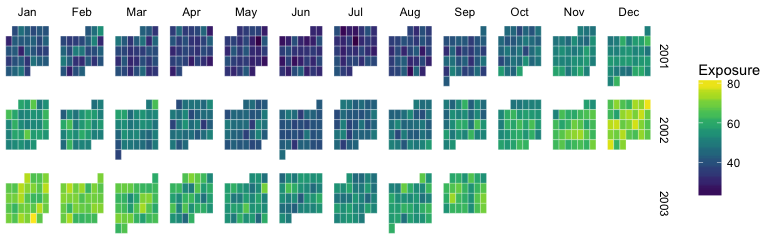
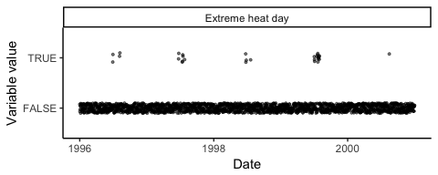
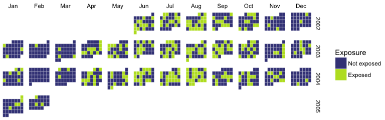

<!-- README.md is generated from README.Rmd. Please edit that file -->
Overview of package
-------------------

This package allows you to simulate time series of environmental health data and perform simulation-based power analyses and other measures of model performance. The package includes four main parts:

1.  Generation of exposure data;
2.  Generation of outcome data;
3.  Fitting models to simulated data; and
4.  Evaluating model performance on simulated data.

The user has the option to customize different aspects of the simulation at each of these steps.

The package creates time series that are relevant for environmental epidemiology studies of ambient exposures (e.g., studies of acute mortality risks associated with daily air pollution concentration, daily temperature, or occurance of a community-wide extreme event like a heat wave).

Basic example of using the package
----------------------------------

The main function of this package is the `eesim` function. You can use the `eesim` function to conduct all four steps of the simulation process at once (simulate exposure data, simulate outcome data, fit models to simulated data, and evaluate model performance).

The `eesim` function requires \[required inputs\]. The function returns a list with two elements. The first element gives simulation-specific results: the estimated effect, standard error, t- and p-values, and upper and lower 95% confidence bounds when a model was applied to each set of simulated data. The second element gives some measures of model assessment, assessed over all simulations, including the mean beta and relative risk estimates across simulations.

For example, you can use the following call to (1) generate 10 observations of a continuous exposure with mean 100 and standard deviation 10, with a seasonal trend in expected value; (2) generate 10 associated outcome values, where the outcome has an average value of 20 and a relative risk of 1.10 per one-unit increase in the exposure; (3) fit a generalized linear model that controls for long-term and seasonal trends with a natural cubic spline with 1 degree of freedom per year; and (4) evaluate the performace of that model on the simulated data:

\[To do-- increase `n` and `n_reps`, but wait until we've edited the vignette, because that will increase time to render. We could change `df` then, too (and maybe change to case-crossover? That may be easier for a first example)\]

``` r
ex_sim <- eesim(n_reps = 100, n = 10, central = 100, sd = 10,
                exposure_type = "continuous", 
                average_outcome = 20, rr = 1.10,
                model = "spline", df_year = 1)
head(ex_sim[[1]])
#>     Estimate    Std.Error  t.value      p.value   lower_ci   upper_ci
#> 1 0.09533666 4.916188e-05 1939.239 2.560664e-21 0.09524031 0.09543302
#> 2 0.09536489 4.673736e-05 2040.443 1.793504e-21 0.09527329 0.09545649
#> 3 0.09532688 4.300159e-05 2216.822 1.003824e-21 0.09524260 0.09541116
#> 4 0.09533395 8.181173e-05 1165.285 9.051988e-20 0.09517361 0.09549430
#> 5 0.09546160 7.228585e-05 1320.613 3.770002e-20 0.09531993 0.09560328
#> 6 0.09552349 9.546583e-05 1000.604 2.629845e-19 0.09533638 0.09571060
ex_sim[[2]]
#>     beta_hat   rr_hat var_across_betas mean_beta_var percent_bias coverage
#> 1 0.09532635 1.100018     9.314353e-09  7.531457e-09 -0.001617087     0.87
#>   power
#> 1     1
```

The first element of the returned object can be used to explore the behavior of individual simulations. For example, to look at the relative risk point estimate and 95% confidence interval from each of the 100 simulations, as well as which 95% confidence intervals include the true relative risk using the following call:

``` r
ex_sim[[1]] %>%
  arrange(Estimate) %>%
  mutate(index = 1:n(),
         rr = exp(Estimate),
         lower_rr = exp(lower_ci),
         upper_rr = exp(upper_ci),
         includes_true = lower_rr < 1.10 & 1.10 < upper_rr) %>%
  ggplot(aes(x = index, y = rr, color = includes_true)) + 
  coord_flip() + 
  geom_point() + 
  geom_errorbar(aes(ymin = lower_rr, ymax = upper_rr)) + 
  geom_hline(yintercept = 1.10, linetype = 2) + 
  scale_color_manual(values = c("red", "darkgray")) +
  theme(legend.position="none",
        panel.background = element_rect(fill='white', colour='white')) + 
  ylab("Relative risk") +
  scale_x_discrete(breaks = NULL) + xlab("") 
```


The second element of the returned object gives the following overall summaries of model performance across all simulations:

| Variable           | Description                                                                                   |
|:-------------------|:----------------------------------------------------------------------------------------------|
| `beta_hat`         | The mean estimated effect (log relative risk) over all simulations                            |
| `rr_hat`           | The mean relative risk over all simulations                                                   |
| `var_across_betas` | Variance of the point estimates of the estimated effect over all simulations                  |
| `mean_beta_var`    | The mean across simulations of the variances of each estimated effect                         |
| `percent_bias`     | Relative bias of the mean of the estimated coefficients                                       |
| `coverage`         | Percent of simulations for which the 95% confidence interval estimate includes the true value |
| `power`            | NA                                                                                            |

Piece-by-piece breakdown of package utility
-------------------------------------------

To demonstrate how the `eesim` function works, here is a breakdown of each of the four main parts: generating exposure data, generating outcome data, fitting models, and evaluating models. The helper functions used for each step are described in detail in this section.

### Generating exposure data

The first task of the package is generating exposure data. This can be dones with the `sim_exposure` function. In this function, the user can specify whether they would like the exposure data to be binary or continuous (`exposure_type`). For continuous exposure data, the user can specify the mean (`central`) and standard deviation (`sd`) of the exposure data:

``` r
x_cont <- sim_exposure(n = 1000, central = 50, sd = 5,
                      exposure_type = "continuous") 
x_cont %>% slice(1:5)
#>         date        x
#> 1 2001-01-01 57.08988
#> 2 2001-01-02 51.50647
#> 3 2001-01-03 47.25674
#> 4 2001-01-04 44.60190
#> 5 2001-01-05 52.15883
```

``` r
ggplot(x_cont, aes(x = date, y = x)) + geom_point(alpha = 0.2)
```


``` r
x_cont %>% 
  mutate(Weekday = lubridate::wday(date), 
         Month = lubridate::month(date, label = TRUE),
         Year = lubridate::year(date),
         Exposure = x) %>% 
  group_by(Year, Month) %>%
  dplyr::mutate(saturday = lag(Weekday) == 7,
                saturday = ifelse(is.na(saturday), 0, saturday),
                Week = 1 + cumsum(saturday)) %>%
  ungroup() %>%
  ggplot(aes(x = Weekday, y = Week, fill = Exposure)) + 
   geom_tile(colour = "white") + 
   facet_grid(Year ~ Month, scales = "free") + 
  scale_fill_gradientn(colours = viridis(256)) + 
  scale_y_reverse() + theme_void()
```


For binary exposure data, the `central` argument gives the probability of exposure on a study day:

``` r
x_bin <- sim_exposure(n = 1000, central = 0.1,
                      exposure_type = "binary")
x_bin %>% slice(1:5)
#>         date x
#> 1 2001-01-01 0
#> 2 2001-01-02 0
#> 3 2001-01-03 0
#> 4 2001-01-04 0
#> 5 2001-01-05 0
```

``` r
x_bin %>% 
  mutate(Weekday = lubridate::wday(date), 
         Month = lubridate::month(date, label = TRUE),
         Year = lubridate::year(date),
         Exposure = factor(x, levels = c(0, 1), 
                    labels = c("Not exposed", "Exposed"))) %>% 
  group_by(Year, Month) %>%
  dplyr::mutate(saturday = lag(Weekday) == 7,
                saturday = ifelse(is.na(saturday), 0, saturday),
                Week = 1 + cumsum(saturday)) %>%
  ungroup() %>%
  ggplot(aes(x = Weekday, y = Week, fill = Exposure)) + 
   geom_tile(colour = "white") + 
   facet_grid(Year ~ Month, scales = "free") + 
  scale_fill_manual(values = c("#414487FF", "#7AD151FF")) + 
  scale_y_reverse() + theme_void()
```


For environmental epidemiology applications, exposure data often has a seasonal trend and / or long-term trend. The default for `sim_exposure` is to simulate the exposure data without a time trend (`trend = "no trend"`). However, we have also built in several time trends from which a user can to choose to simulate exposure data with a time trend, either seasonal or long-term or both. These trend patterns differ slightly depending on whether the user is simulating binary or continuous data. \[add reference for Schwartz paper where we got some of the trend equations\] Below are plots of the built-in trends for continuous exposure data from which the user may choose.


The trend options are similar for binary exposure, but exclude "curvilinear" and "cos1linear" and include a "monthly" trend, for which the user enters a vector of 12 probabilities of exposure, one for each month.

Here is an example of generating continuous exposure data with a "cos1linear"" trend:

``` r
testexp <- sim_exposure(n=1000, central = 50, sd = 5, trend = "cos1linear",
                        amp = .6, exposure_type = "continuous")
head(testexp)
#>         date        x
#> 1 2001-01-01 57.25718
#> 2 2001-01-02 65.25161
#> 3 2001-01-03 54.45958
#> 4 2001-01-04 49.72080
#> 5 2001-01-05 48.35436
#> 6 2001-01-06 59.46657
qplot(testexp$date, testexp$x)+geom_point()+coord_cartesian(ylim = c(0,110)) + labs(title = "Exposure with a cos1linear trend", x = "Date", y="Exposure")+theme_bw()
```


``` r
testexp %>% 
  mutate(Weekday = lubridate::wday(date), 
         Month = lubridate::month(date, label = TRUE),
         Year = lubridate::year(date),
         Exposure = x) %>% 
  group_by(Year, Month) %>%
  dplyr::mutate(saturday = lag(Weekday) == 7,
                saturday = ifelse(is.na(saturday), 0, saturday),
                Week = 1 + cumsum(saturday)) %>%
  ungroup() %>%
  ggplot(aes(x = Weekday, y = Week, fill = Exposure)) + 
   geom_tile(colour = "white") + 
   facet_grid(Year ~ Month, scales = "free") + 
  scale_fill_gradientn(colours = viridis(256)) + 
  scale_y_reverse() + theme_void()
```


The default amplitude for the trend is .6, but we can adjust the "amp" parameter for a smaller or larger trend amplitude:

``` r
smallamp <- sim_exposure(n=1000, central = 50, sd = 5, trend = "cos1linear",
                        amp = .2, exposure_type = "continuous")
qplot(smallamp$date, smallamp$x)+geom_point()+coord_cartesian(ylim = c(0,110))+labs(title = "Cos1linear exposure with smaller amplitude", x="Date", y="Exposure") + theme_bw()
```


``` r
smallamp %>% 
  mutate(Weekday = lubridate::wday(date), 
         Month = lubridate::month(date, label = TRUE),
         Year = lubridate::year(date),
         Exposure = x) %>% 
  group_by(Year, Month) %>%
  dplyr::mutate(saturday = lag(Weekday) == 7,
                saturday = ifelse(is.na(saturday), 0, saturday),
                Week = 1 + cumsum(saturday)) %>%
  ungroup() %>%
  ggplot(aes(x = Weekday, y = Week, fill = Exposure)) + 
   geom_tile(colour = "white") + 
   facet_grid(Year ~ Month, scales = "free") + 
  scale_fill_gradientn(colours = viridis(256)) + 
  scale_y_reverse() + theme_void()
```



Here is an example of generating binary exposure data with a "monthly" trend starting from June 1, 2002. The probabilities for the central parameter are for each month of the year, starting in January.

``` r
testbin <- sim_exposure(n=1000, central = c(.1,.1,.2,.3,.4,.4,.5,.6,.5,.3,.2,.1),
                        trend = "monthly", exposure_type = "binary", 
                        start.date = "2002-06-01")
head(testbin)
#>         date x
#> 1 2002-06-01 1
#> 2 2002-06-02 0
#> 3 2002-06-03 1
#> 4 2002-06-04 0
#> 5 2002-06-05 1
#> 6 2002-06-06 0
qplot(testbin$date, testbin$x)+geom_point()+labs(title = "Binary exposure data with monthly trend", x="Date", y="Exposure")+theme_bw()
```



``` r
testbin %>% 
  mutate(Weekday = lubridate::wday(date), 
         Month = lubridate::month(date, label = TRUE),
         Year = lubridate::year(date),
         Exposure = factor(x, levels = c(0, 1), 
                    labels = c("Not exposed", "Exposed"))) %>% 
  group_by(Year, Month) %>%
  dplyr::mutate(saturday = lag(Weekday) == 7,
                saturday = ifelse(is.na(saturday), 0, saturday),
                Week = 1 + cumsum(saturday)) %>%
  ungroup() %>%
  ggplot(aes(x = Weekday, y = Week, fill = Exposure)) + 
   geom_tile(colour = "white") + 
   facet_grid(Year ~ Month, scales = "free") + 
  scale_fill_manual(values = c("#414487FF", "#7AD151FF")) + 
  scale_y_reverse() + theme_void()
```



The following figure shows the steps taken in simulating exposure ...


### Generating outcome data

Next, the eesim package uses the exposure data to generate health outcome data with or without seasonal trends. eesim creates "baseline" values for outcome based on the user-specified trend and average outcome. Next it uses the following function to relate exposure and relative risk to outcomes:
*λ* = *e*<sup>log(*b**a**s**e**l**i**n**e*) + log(*r**e**l**a**t**i**v**e**r**i**s**k*) \* *e**x**p**o**s**u**r**e*</sup>
 The values of lambda are then used to randomize the outcome values around the baseline with a Poisson($$) distribution.

Here is an example of generating health outcome data with an upward linear trend using exposure data with a "cos1" trend:

``` r
testexp2 <- sim_exposure(n=1000, central = 100, sd = 10, trend = "cos1", exposure_type = "continuous")
testout <- sim_outcome(exposure = testexp2, average_outcome = 22, trend = "linear", rr = 1.01)
qplot(testout$date, testout$outcome)+geom_point()+labs(title = "Health outcomes with a linear trend", x="Date", y="Outcome") + theme_bw()
```


``` r
testout %>% 
  mutate(Weekday = lubridate::wday(date), 
         Month = lubridate::month(date, label = TRUE),
         Year = lubridate::year(date),
         Exposure = outcome) %>% 
  group_by(Year, Month) %>%
  dplyr::mutate(saturday = lag(Weekday) == 7,
                saturday = ifelse(is.na(saturday), 0, saturday),
                Week = 1 + cumsum(saturday)) %>%
  ungroup() %>%
  ggplot(aes(x = Weekday, y = Week, fill = Exposure)) + 
   geom_tile(colour = "white") + 
   facet_grid(Year ~ Month, scales = "free") + 
  scale_fill_gradientn(colours = viridis(256)) + 
  scale_y_reverse() + theme_void()
```


### Fitting models

eesim next uses many generated data sets to fit statistical models to relate exposure to outcome and estimate relative risk. The built-in model choices are a spline model and a case-crossover model. The fit\_mods function outputs a data frame with estimates of the log relative risk, p-values, and upper and lower 95% confidence bounds for each simulated data set.

Here is an example of fitting the spline model with 7 degrees of freedom:

``` r
sims <- create_sims(n_reps=10, n=100, central = 100, sd = 10,
             exposure_type="continuous", exposure_trend = "cos1",
             exposure_amp = .6, average_outcome = 22,
             outcome_trend = "no trend", outcome_amp = .6, rr = 1.01)
fits <- fit_mods(outcome = sims, model = "spline", df_year = 7)
fits
#>       Estimate   Std.Error  t.value      p.value    lower_ci   upper_ci
#> 1  0.010586851 0.001583055 6.687608 1.502688e-09 0.007484120 0.01368958
#> 2  0.009372260 0.001363494 6.873708 6.291086e-10 0.006699861 0.01204466
#> 3  0.009195273 0.001269303 7.244350 1.087964e-10 0.006707485 0.01168306
#> 4  0.009129928 0.001237680 7.376648 5.781131e-11 0.006704120 0.01155574
#> 5  0.009656006 0.001133307 8.520200 2.226316e-13 0.007434765 0.01187725
#> 6  0.012572399 0.001454722 8.642473 1.220013e-13 0.009721196 0.01542360
#> 7  0.010344257 0.001360217 7.604860 1.929996e-11 0.007678281 0.01301023
#> 8  0.008963447 0.001327339 6.752943 1.107860e-09 0.006361910 0.01156498
#> 9  0.008963204 0.001418718 6.317820 8.276811e-09 0.006182568 0.01174384
#> 10 0.011746319 0.001380077 8.511351 2.325280e-13 0.009041418 0.01445122
```

### Evaluating the models

Lastly, eesim evaluates model performance with several different measures. The check\_sims function takes the true relative risk as input and returns mean beta and relative risk estimates across all simulated data sets, variance of the estimates of beta, the mean of the variances of each beta hat, the relative bias of the mean of the beta hats, the percent coverage of the true beta, and the power of the test at the 5% significance level.

Here is an example of the use of the check\_sims function:

``` r
check_sims(fits, true_rr = 1.01)
#>     beta_hat   rr_hat var_across_betas mean_beta_var percent_bias coverage
#> 1 0.01005299 1.010104     1.574231e-06  1.843815e-06  -0.01033777        1
#>   power
#> 1     1
```

Using custom functions
----------------------

An important feature of eesim is that the user may input custom functions for any part of the simulation process. For example, the user may wish to generate exposure data with a custom trend, then automate the process of generating outcomes, fitting models, and evaluating performance using the built-in features of eesim. Functions the user has the option to customize within the eesim framework are exposure trend, outcome baseline, and outcome lambda. A custom model may also be used as long as returns the necessary output if the model assessmen tools in eesim are to be used.

To use custom functions within eesim, the user must input the name of the custom function as well as a list of all arguments for the custom function and their values. Many inputs for the eesim functions may no longer be necessary when a custom function is used, in which case they can simply be left out.

### Custom exposure trend

Here is an example of using a custom function to specify an exposure trend that is not built in to eesim:

``` r
sintrend <- function(n, mu, y){
  day <- c(1:n)
  base <- mu + y * sin(2 * pi * (day / 365))
  rnorm(n, mean = base, sd = 1)
}
customexp <- sim_exposure(n=1000, exposure_type = "continuous", cust_exp_func = sintrend, cust_exp_args = list(n=1000, mu = 75, y=3))
head(customexp)
#>         date        x
#> 1 2001-01-01 75.48112
#> 2 2001-01-02 75.25652
#> 3 2001-01-03 75.03134
#> 4 2001-01-04 76.81056
#> 5 2001-01-05 74.83267
#> 6 2001-01-06 72.26150
qplot(customexp$date, customexp$x)+geom_point()+labs(title = "Exposure values with a custom trend", x="Date", y="Exposure")+theme_bw()
```


``` r
customexp %>% 
  mutate(Weekday = lubridate::wday(date), 
         Month = lubridate::month(date, label = TRUE),
         Year = lubridate::year(date),
         Exposure = x) %>% 
  group_by(Year, Month) %>%
  dplyr::mutate(saturday = lag(Weekday) == 7,
                saturday = ifelse(is.na(saturday), 0, saturday),
                Week = 1 + cumsum(saturday)) %>%
  ungroup() %>%
  ggplot(aes(x = Weekday, y = Week, fill = Exposure)) + 
   geom_tile(colour = "white") + 
   facet_grid(Year ~ Month, scales = "free") + 
  scale_fill_gradientn(colours = viridis(256)) + 
  scale_y_reverse() + theme_void()
```


This custom exposure function can be called with eesim:

``` r
ex_sim2 <- eesim(n_reps = 3, n = 10, central = 100, sd = 10,
                exposure_type = "continuous", exposure_trend = "custom", 
                exposure_amp = .6, cust_exp_func = sintrend,
                cust_exp_args = list(n=10, mu=75,y=3),
                average_outcome = 22, rr = 1.01, 
                model = "spline", df_year = 1)
#> Error in do.call(custom_func, arguments): 'what' must be a function or character string
ex_sim2
#> Error in eval(expr, envir, enclos): object 'ex_sim2' not found
```

### Custom outcomes

There are two ways to customize the simulated outcome data: creating a custom baseline for outcome values or customizing the relationship between outcome and exposure.

The outcome baseline is comprised of the values the user expects the outcomes to take on without exposure factored in. The user may write a function to specify the trend of the baseline, then use it as an input in sim\_outcome or eesim. Here is an example of creating a custom baseline function and using it in the eesim function:

``` r
custombase <- function(n, slope, intercept){
  day <- c(1:n)
  baseline <- day*slope + intercept
  return(baseline)
}

#Example:
custombase(n=5, slope = .3, intercept = 55)
#> [1] 55.3 55.6 55.9 56.2 56.5

ex_sim3 <- eesim(n_reps = 3, n = 10, central = 100, sd = 10,
                exposure_type = "continuous", exposure_trend = "cos1",
                exposure_amp = .6, average_outcome = 22, rr = 1.01, 
                cust_base_func = custombase, cust_base_args = list(n=10, slope = .5,                        intercept = 12), model = "spline", df_year = 1)
ex_sim3
#> [[1]]
#>      Estimate   Std.Error  t.value     p.value     lower_ci   upper_ci
#> 1 0.008362381 0.002193767 3.811882 0.006611693  0.004062677 0.01266209
#> 2 0.008460964 0.006648251 1.272660 0.243776981 -0.004569368 0.02149130
#> 3 0.013311137 0.004911580 2.710154 0.030192287  0.003684618 0.02293766
#> 
#> [[2]]
#>     beta_hat   rr_hat var_across_betas mean_beta_var percent_bias coverage
#> 1 0.01004483 1.010098     8.004013e-06  2.437849e-05 -0.009717093        1
#>       power
#> 1 0.6666667
```

Here is an example of creating a custom lambda, meaning a custom function relating relative risk and exposure to outcomes, and using it in eesim with the custom baseline function created above:

``` r
customlambda <- function(exposure, rr, constant, baseline){
  log_lambda <- log(baseline) + log(rr) * exposure + constant
  lambda <- exp(log_lambda)
  return(lambda)
}
```
